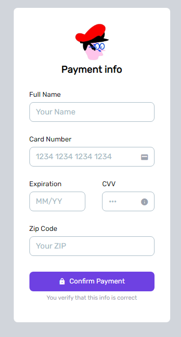
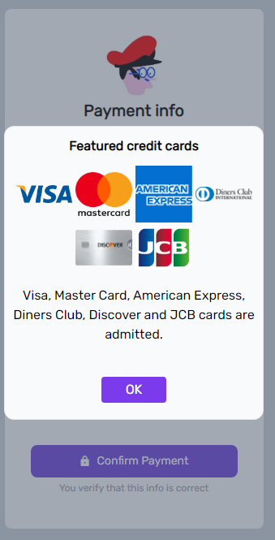
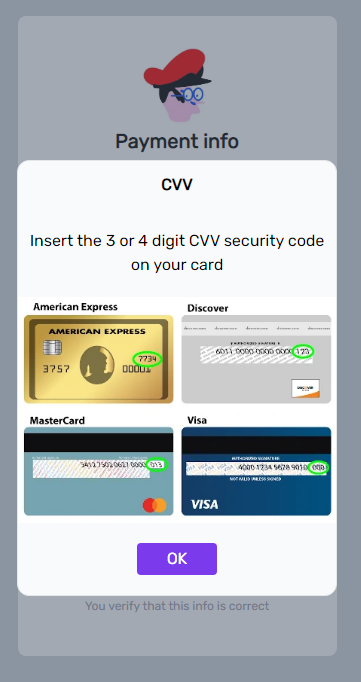

# CHECK OUT FORM

Simple check out page. It includes client-side validation. Several credit cards are supported (*Visa, Master Card, American Express, Diners Club, Discovery, JCB*). Build with **React**, **Vite** and **Tailwind**.

## Background 

This project is made in order to participate in the **Nuwe Talent Squad Frontend III** coding challenge. It is also an oportunity to practice developing functional web components from a given design.

---

## Installation

Clone down this repository. You will need node and npm installed globally on your machine.

Installation:

npm install

To Start Server:

npm start


```shell
    # Clone or install commands
    npm i [project] o npm/yarn i 
```

```shell
    # run commands
    npm start
    npm run dev
```
---

## Stack

###ReactJS
This Javascript library was used in order to make a component-based project, so it is modularized and scalable. Modularization helps specially in code maintenance, wich is key to any coding project.

####Vite
Vite was used to set the React project and boundle it. The use of Vite has been spreading lately due to its efficiency and ease of use.

####React Forms Hook
This React Library is used as a systematic way to handle this form. It allows to implement even more control on the form if it is needed at any time.

####Tailwind
For a simple design as the proposed for this exercise, in combination with React, Tailwind offered a simple way to set styles. Variables are used to help keeping the code clean and easy to mantain:

```shell
    const inputContainerStyle = 'input-container relative flex flex-col justify-items-center items-start mt-5 '
    const labelStyle = 'label mt-[9px] text-sm leading-[14px] font-medium';
    const inputStyle = 'input w-full h-10 text-lg mt-[8px] p-3 border border-solid border-[1.5px] border-[#A7BAC5] placeholder-[#A7BAC5] placeholder-font-300 rounded-lg';
    const validationStyle = 'validation-msg absolute top-[72px] text-xs font-semibold ml-2 text-red-400'
```

```shell
            <div className={`${inputContainerStyle} mt-[24px]`}>
```
---


## Roadmap and visuals

The apparence of the project is simple and readable. It has a default view, with the form the user needs to fill. It has, however two information screens that can be shown over it: the featured cards pannel and the CVV info pannel:

<div style="display:flex; justify-content:space-around">
    <div style="display:flex; flex-direction:column; justify-content:center; align-items:center">
        
        <p>Default view</p>
    </div>
    <div style="display:flex; flex-direction:column; justify-content:center; align-items:center">
        
        <p>Featured credit cards</p>
    </div>
    <div style="display:flex; flex-direction:column; justify-content:center; align-items:center">
        
        <p>CVV security code</p>
    </div>
</div>

---


## Contact info

This project was made by August Ollé Corbella.

Find me on:

[Linkedin](https://linkedin.com/in/augustolle)
[Github](https://github.com/Atorremedia)
[My personal webpage](https://www.augustolle.com)

---

## License 

[MIT](https://opensource.org/licenses/MIT)

